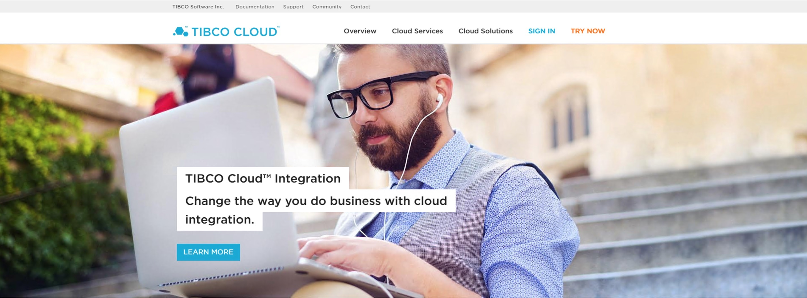
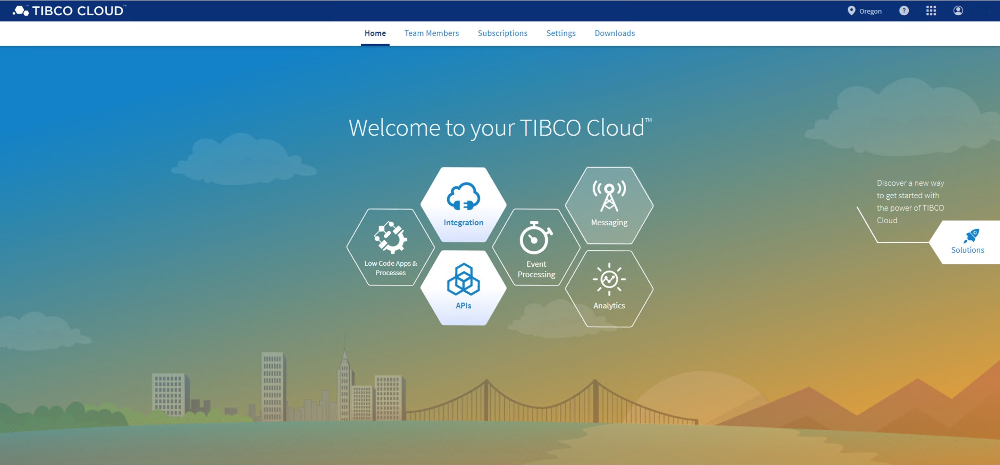

# 1. Validate Your Environment #

In this section, you'll validate your lab environment, which consists of a client machine and a TIBCO Cloud Integration trial environment.

## 1.1 Sign in to TIBCO Cloud ##

### 1.1.1 Getting Ready ###

This lab assumes you have started a trial of TIBCO Cloud™ Integration 
    If you haven't, [click here](https://www.tibco.com/products/tibco-cloud-integration/sign-up?_ga=2.96144156.1661410125.1557311514-1465520282.1557311514) and choose the United States as a region.

### 1.1.2 How to Do It ###

1. Browse to [https://cloud.tibco.com/](https://cloud.tibco.com/).

    
2. Click **SIGN IN** (at the right top), and fill out the relevant account details (**Email Address** and **Password**) in the following screen.

    
3. After this, you should see a landing page which looks similar to this:

    

## 1.2 OPTIONAL - Sign in to Your AWS Instance ##

Besides TIBCO Cloud Integration, the following software will be used:

* [TIBCO Business Studio™ for BusinessWorks™](https://integration.cloud.tibco.com/download) : Select TIBCO Business Studio for BusinessWorks™
* [Postman](https://www.getpostman.com/downloads/)

## 1.3 What's Next ##

[Design an API and Create a Mock Application](001.md)
