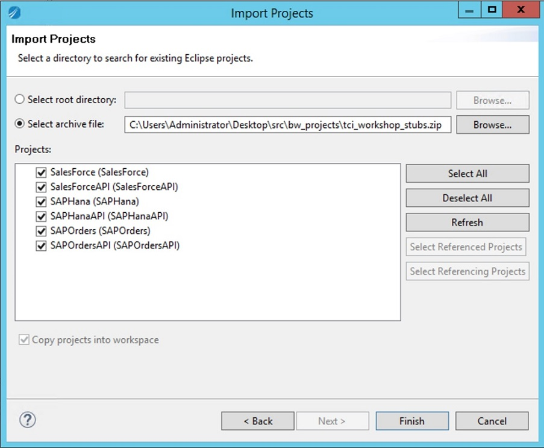
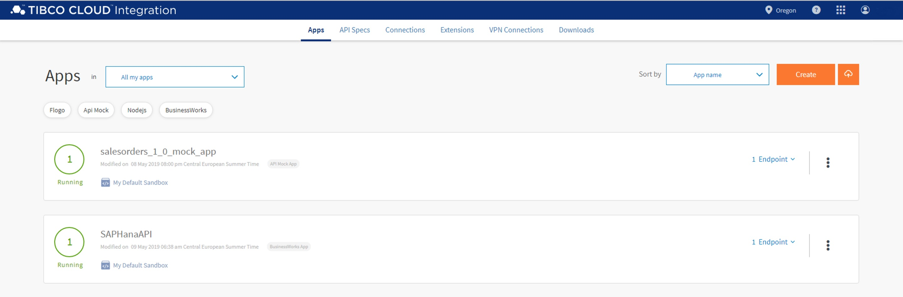
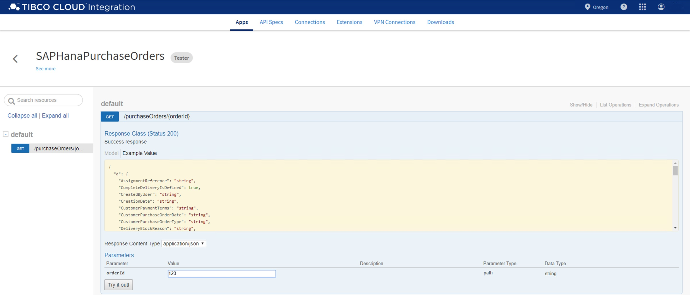

## 3.2 BusinessWorks Apps in TIBCO Cloud Integration ##

In this lab, you'll first connect TIBCO Business Studio™ for BusinessWorks from your workstation to TIBCO Cloud. You'll then import a BusinessWorks project into Business Studio that implements a system API that gets purchase orders from SAP Hana. Finally, you'll push the BusinessWorks app to TIBCO Cloud and test it.

### 3.2.1 Getting Ready ###

To get ready, open TIBCO Business Studio™ for BusinessWorks. Assuming you start with a clean enviroment, your screen should look similar to this:

### 3.2.2 How to Do It: Connect Business Studio to TIBCO Cloud ###

To setup a connection from TIBCO Business Studio™ for BusinessWorks to TIBCO Cloud that enables you to push an app to the cloud directly from TIBCO Business Studio, do the following:

1. Go to API Explorer, click the down arrow in the upper right corner, and click Settings.

    

2. In the **Configure API Settings** form, click the **New** button. Fill out the **URL** and your TIBCO Cloud Integration username and password in the new form.

    | Field         | Value           |
    | ------------- | --------------- |
    | URL           | `https://integration.cloud.tibco.com:443` |
    | Username      | `your@email.com` |
    | Password      | `YoUrPassWoRd`   |

    Your screen should look like this:

    

3. Click the **Finish** button when your done done, and click the **Close** button in the **Configure API Settings** form. The API Explorer should look like this:

    

### 3.2.3 How to Do It: Import a Project in to Business Studio ###

To import a BusinessWorks project into Business Studio that implements a system API, do the following:

1. From the menu, select **File > Import**. In the new form, select **General > Existing Studio Projects into Workspace**.

2. Select the [`tci_workshop_stubs.zip`](../src/bw_projects/tci_workshop_stubs.zip) file from the [`src/bw_projects`](../src/bw_projects) directory. Your screen should look like this:

    

3. Click the **Finish** button. The Project Explorer should look like this:

    

### 3.2.4 How to Do It: Push the Project to TIBCO Cloud and Test It ###

To push the SAP Hana system API app to TIBCO Cloud, do the following:

1. In the Project Explorer, select **SAPHanaAPI > Push to Cloud ...**:

    

2. Navigate to TIBCO Cloud, and once the app has been successfully pushed, your screen should look like this:

    

3. Once the **SAPHanaAPI** app is running, hover over the **Endpoint** link, and select **View and Test** from the menu

4. Test the **SAPHanaAPI** app by filling out a value in the **orderId** field, and clicking on the **Try it out!** button:

    

5. Copy the URL, which has a pattern like `https://integration.cloud.tibcoapps.com:443/xxxxx/PurchaseOrders/purchaseOrders/{orderId}`, and store it somewhere. You will need it when you implement the process API in the next lab.

## 3.3 See Also ##

**BusinessWorks (Cloud Integration)**

* [TIBCO Cloud Integration: Getting Started with BusinessWorks Applications](https://community.tibco.com/wiki/tibco-cloud-integration-getting-started-businessworks-applications)
* [TIBCO Business Studio™ - Cloud Edition](https://integration.cloud.tibco.com/docs/bw/index.html)
* [TIBCO ActiveMatrix BusinessWorks™ Plug-ins](https://integration.cloud.tibco.com/docs/connectors/index.html)
* [TIBCO® Cloud Integration Frequently Asked Questions](https://community.tibco.com/wiki/tibcor-cloud-integration-frequently-asked-questions)

## 3.4 What's Next ##

[Distribute & Manage your API](003.md)
