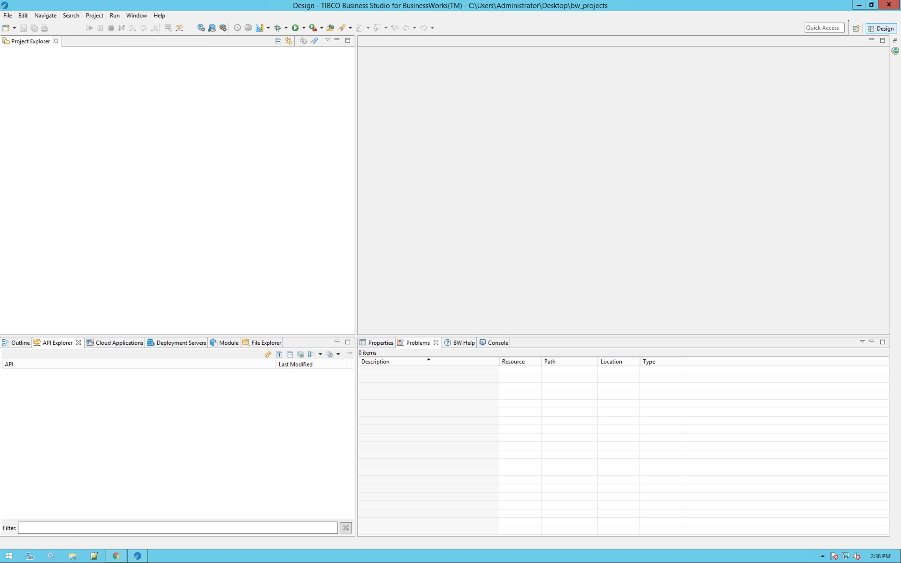

# 3. Build and Deploy Your API #

In this section, you'll first connect TIBCO Business Studio™ for BusinessWorks from your workstation to TIBCO Cloud, import a BusinessWorks project into Business Studio that implements a system API, and then deploy it to TIBCO Cloud and test it. Then you will implement a process API - that orchestrates over 3 system APIs - using Flogo, and deploy and test it.

## 3.1 BusinessWorks Application in TCI ##

### 3.1.1 Getting Ready ###

To get ready, start TIBCO Business Studio™ for BusinessWorks. Assuming you start with a clean enviroment, your screen should look similar to this:

### 3.1.2 How to Do It: Connect Business Studio to TIBCO Cloud ###

### 3.1.3 How to Do It: Import a Project in to Business Studio ###

### 3.1.4 How to Do It: Deploy the Project to TIBCO Cloud ###

### 3.1.5 How to Do It: Test the Deployed API ###

## 3.2 Flogo Apps in TCI ##

### 3.2.1 Getting Ready ###

### 3.2.2 How to Do It: Implement the Flogo App ###

### 3.2.3 How to Do It: Deploy the Flogo App ###

### 3.1.4 How to Do It: Test the API ###

## 3.3 What's Next ##

https://integration.cloud.tibco.com
