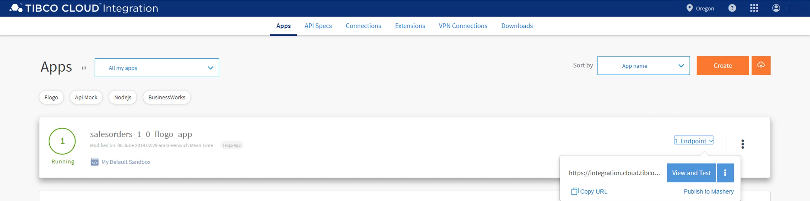

# 4. Distribute & Manage your API #

In this section you'll turn the SalesOrder API into a managed API by publishing it to Mashery. After that, you'll apply for a key in order to be able to consume the API. Once you have the key, you will test the API by calling it from Postman.

## 4.1 Publish API to Mashery ##

### 4.1.1 Getting Ready ###

This lab assumes you've already navigated to the Integration capability, and can see the **salesorders_1_0_flogo_app** running so your screen looks something like this:

### 4.2.1 How to Do It ###

To publish the **SalesOrder** API to Mashery, do the following:

1. Assuming the **salesorders_1_0_flogo_app** app is running, hover over the **Endpoint** link, and select **Publish to Mashery** from the menu:

    

2. Select the traffic manager domain in the next form (**Note**: the name of the selected traffic manager domain should match the pattern below, i.e. **evalxxxxxx.api.mashery.com**), and click **Next**:

    

3. Create a new API definition by clicking on the **+ New definition** link in the next form. Give the definition a name, e.g. **SalesOrderAPI**, and click on the **Create** button.

    

4. Select the **SalesOrderAPI**

    

5. Select the operation **POST /sync/{orderId}** to publish to the **SalesOrderAPI**, and click **Next**:

    

6. Create a package (click the **Create Package** button), give it a name, e.g. **SalesOrderPackage**, and click the **Create** button:

    

7. Select the **SalesOrderPackage**, create a plan (by clicking the **Create a plan** button), give it a name, e.g. **BasePlan**, and click the **Create** button (**Note**: ensure that the **Allow self-provisioning keys** box is checked):

    

   Click **Done** when everything completed successfully:

   

## 4.2 Configure API Definitions & Plans ##

Now that you have publisher the SalesOrder API to Mashery

### 4.2.1 Getting Ready ###

Navigate to the APIs capability

## 4.2 Register for an API Key ##

### 4.2.1 How to Do It ###

To register for an API key, do the following:

1. Navigate to the APIs section of TIBCO Cloud, and go to the **Developer Portal**:

2. Register an application and apply for an API key:

## 4.3 Postman Test ##

1. Copy the API key

2. Get the URL exposed on Mashery API design. Navigate to the **Control Center**, and select **Design > APIs > SalesOrderAPI > SalesOrderAPI > salesorders_1_0_flogo_app__sync_orderId > Domains & Traffic Routing**
