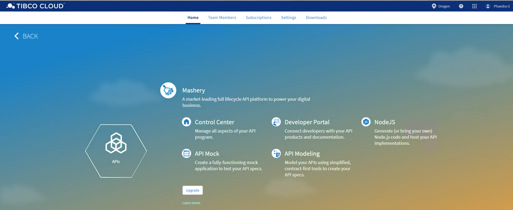
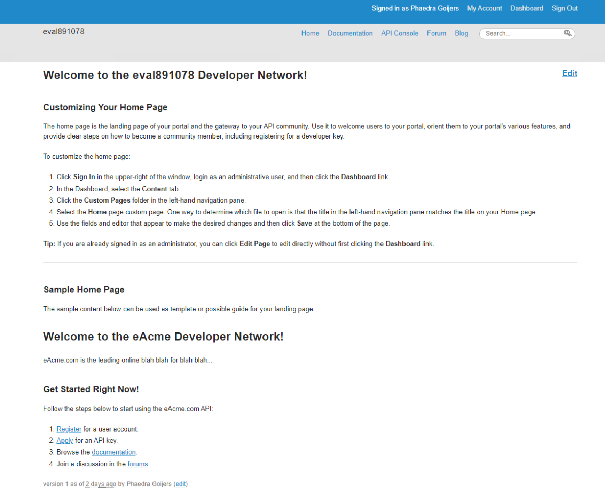
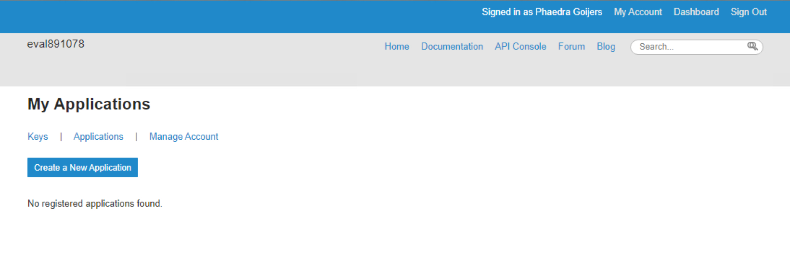
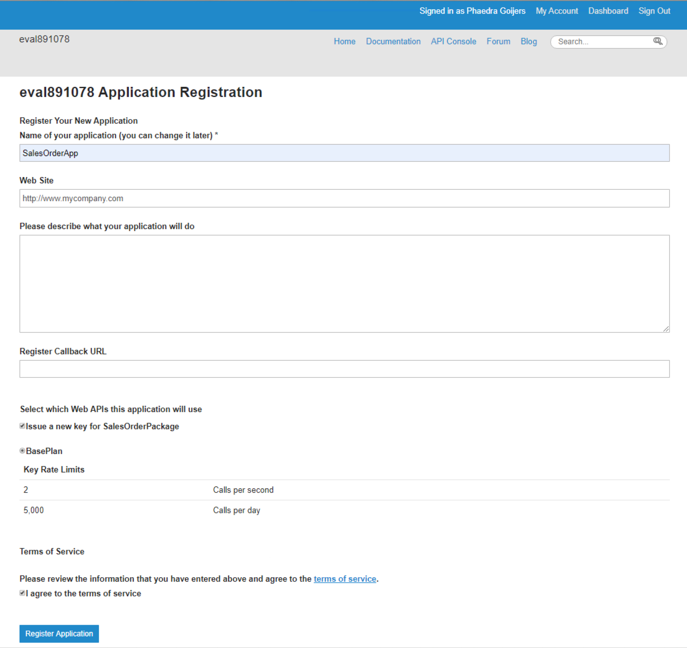
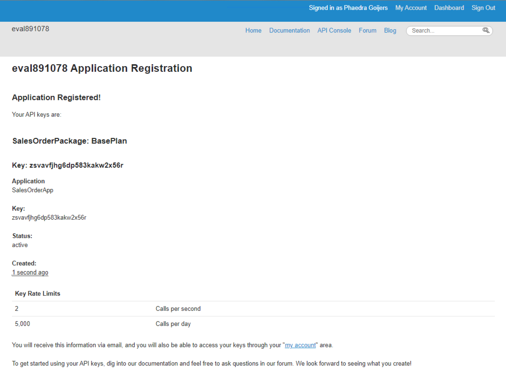
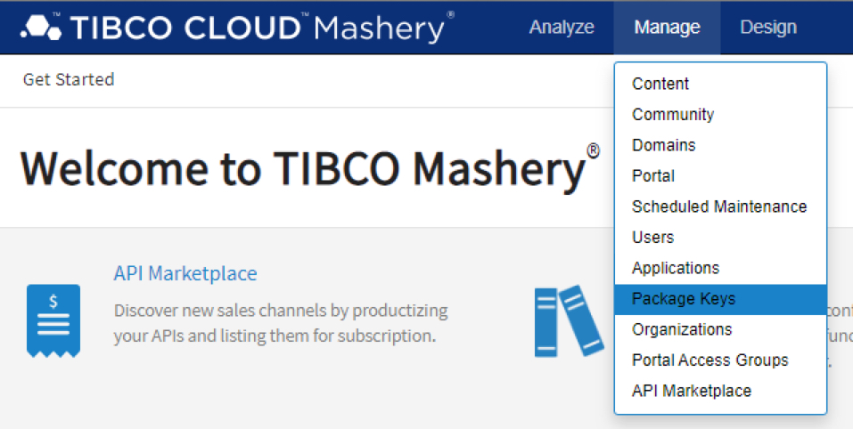
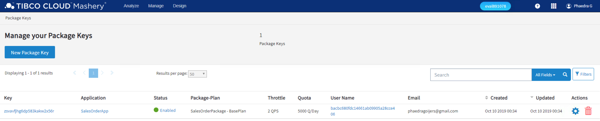
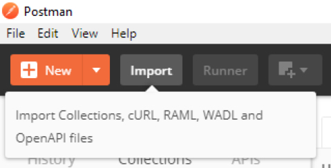
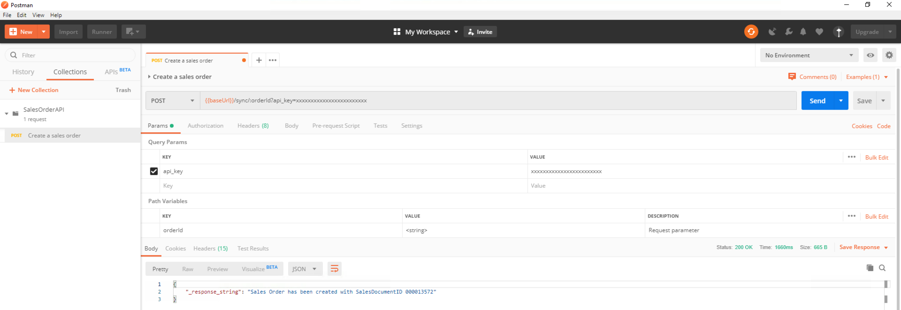
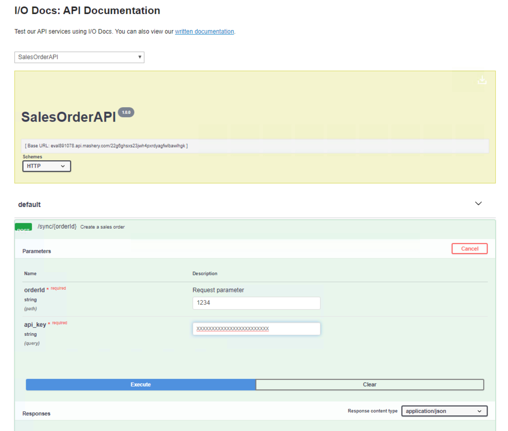

# 5 Testing your APIs #

## 5.1 Register an Application for an API Key ##

In the lab, you will create and register an application for the managed SalesOrder API.

### 5.1.1 How to Do It ###

In order to register for an API key, do the following:

1. Navigate to the APIs section:

    

2. Click on **Developer Portal** so your screen looks like this:

    

3. From the top menu, click on **My Account**, and click on **Applications** in the next screen.

    

4. Click the **Create a New Application** button, and specify the following values in the next form:

    | Name | Value |
    | ---- | ----- |
    | Name of your application | SalesOrderApp |
    | Web Site | `http://www.mycompany.com` |

    Ensure that the **Issue a new key for SalesOrderPackage** and **I agree to the terms of service** are checked, and **BasePlan** is selected. Then click the **Register Application** button.

    

5. Copy and save the API key from the next screen (**Application Registered!**)

    

6. To verify that the API key is enabled, click on **Dashboard** in the top menu. In the next screen, select **Manage > Package Keys** from the top menu bar

    

    and verify that the API key is enabled.

    

    If the key is not enabled, select the API key, change the **Status** to **Enabled**, and save the changes.

## 5.2 Test the API using Postman ##

In this lab, you'll first edit and save a Swagger specification for the managed SalesOrder API, and then import it into Postman so you can test the managed API using the API key.

### 5.2.1 How to Do It ###

1. Open the [`src/mashery/SalesOrders.json`](../src/mashery/SalesOrders.json) file, and save it as `SalesOrders-Mashery.json`. In the new file, replace the values for **host** and **basePath**, with the **host** part (i.e. **evalxxxxxx.api.mashery.com**) and the **base path** part (i.e. **/nnnnnnnnnnnnnnnnnnnnnnnnnnnnnnnn**) of the public domain URL of the managed API saved in lab 4.2:

    ```json
      ...
      "host": "evalxxxxxx.api.mashery.com",
      ...
      "basePath": "/nnnnnnnnnnnnnnnnnnnnnnnnnnnnnnnn"
      ...
    ```

    Save the file.

2. Start Postman, and import the `SalesOrders-Mashery.json` file:

    

3. Select the request from the **SalesOrderAPI**. Copy the API key to the value of the **api_key** query parameter, and press the **Send** button. If everything goes well, the result should look something like this:

    


4. Back to TIBCO Mashery, navigate to the **Developer Portal**, and click on **API Console**. In the new screen, select **SalesOrderAPI**, and click on the **Try it out** button. Fill out the values for the **orderId** and the **api_key**, and click the **Execute** button.

    

    If everything goes well, you'll see the same response as in the previous test with Postman.

## 5.4 See Also ##

* [TIBCO Cloud™ Mashery Documentation](https://docs.mashery.com)
* [TIBCO Mashery® Community Wiki](https://community.tibco.com/wiki/tibco-mashery-community-wiki)

## 5.5 What's Next ##

[Customize your API Portal](005.md)
